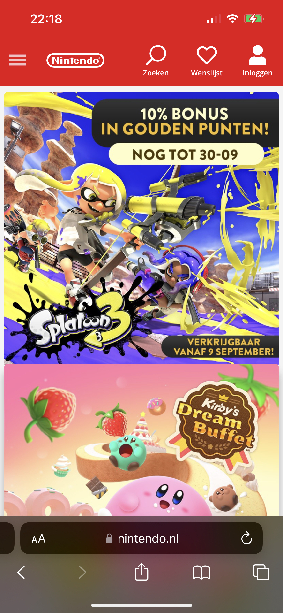
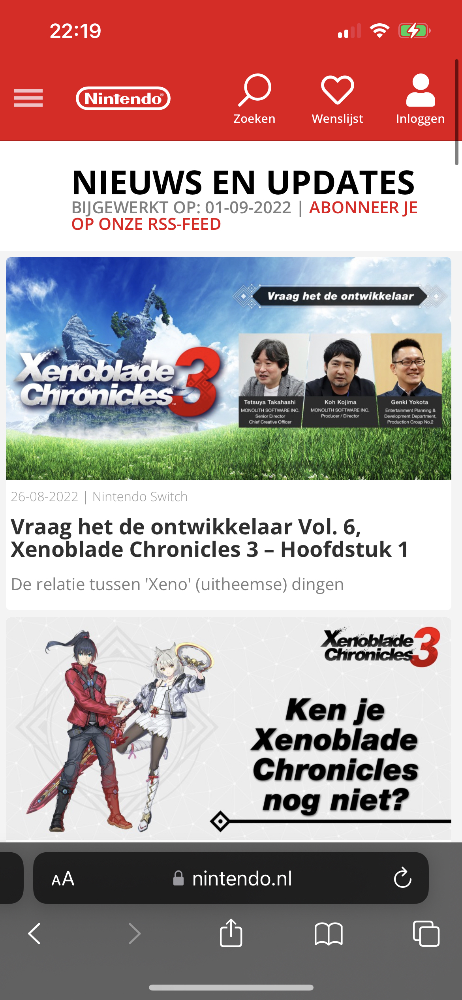
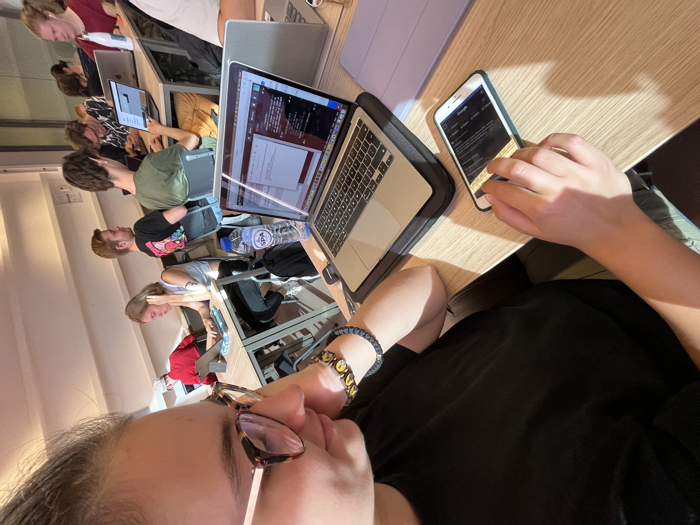
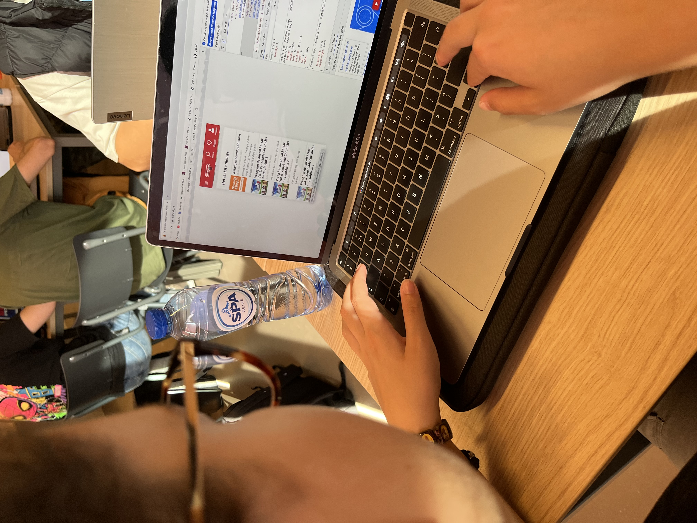
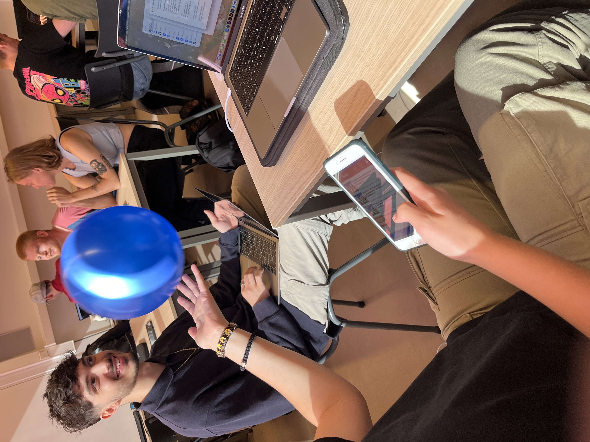
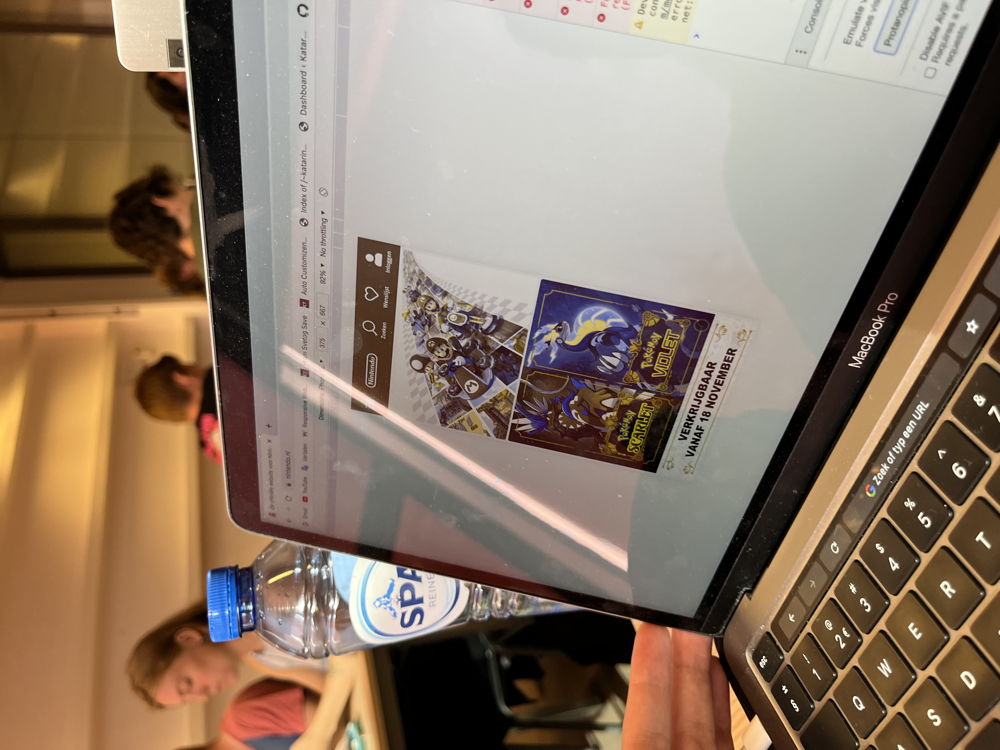
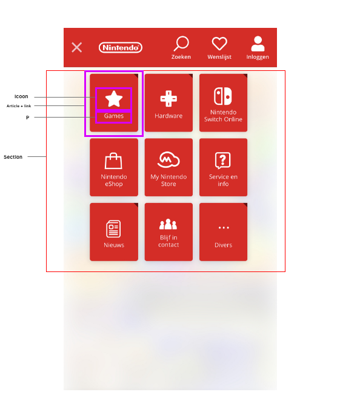

# Procesverslag
Markdown is een simpele manier om HTML te schrijven.  
Markdown cheat cheet: [Hulp bij het schrijven van Markdown](https://github.com/adam-p/markdown-here/wiki/Markdown-Cheatsheet).

Nb. De standaardstructuur en de spartaanse opmaak van de README.md zijn helemaal prima. Het gaat om de inhoud van je procesverslag. Besteedt de tijd voor pracht en praal aan je website.

Nb. Door *open* toe te voegen aan een *details* element kun je deze standaard open zetten. Fijn om dat steeds voor de relevante stuk(ken) te doen.

## Jij

  
uitwerken voor kick-off werkgroep

  ### Auteur:
  Raúl Paays

  #### Je startniveau:
  Blauw

  #### Je focus:
  Surface Planet
 

## Je website

  
uitwerken voor kick-off werkgroep

  ### Je opdracht:
  https://www.nintendo.nl

  #### Screenshot(s) van de eerste pagina (small screen): 
  Nintendo Home
  

  #### Screenshot(s) van de tweede pagina (small screen):
  Nintendo Nieuws  
  
 

## Toegankelijkheidstest 1/2 (week 1)

  
uitwerken na test in 1e werkgroep

  ### Bevindingen
  Lijst met je bevindingen die in de test naar voren kwamen:

  #### Screenreader
  Hier korte omschrijving (met indien nodig afbeeldingen):
  Frustrerend
  Alles opgelezen
  Moeite met swipen
  Wist niet hoe ze moest klikken
  

  Hier een omschrijving van hoe het opgelost kan worden (met indien nodig afbeeldingen)
  Beter aangeven hoe afbeeldingen te swipen (Misschien een scrolbar)

  #### Muis en Toetsenbord 
  Hier korte omschrijving (met indien nodig afbeeldingen):
  In de nav een klein lijntje / onduidelijk
  Met rood omcirkeld in de active state 
  

  Hier een omschrijving van hoe het opgelost kan worden (met indien nodig afbeeldingen)
  Duidelijker in de nav aangeven

  #### Motoriek (shocks, elastiekjes)
  Hier korte omschrijving (met indien nodig afbeeldingen):
  Werkte nog steeds omdat het niet zoveel acties heeft op het homescherm
  
  Hier een omschrijving van hoe het opgelost kan worden (met indien nodig afbeeldingen)
  -

  #### Visueel (brillen, contrast, kleurenblind, dark/light). 
  Hier korte omschrijving (met indien nodig afbeeldingen):
  Periphical field loss: via de zijkant kijken
  Central Field Loss: witte letters minder goed zichtbaar: Groene kleine letters minder goed zichtbaar
  Cataract: Sommige lettertypes zijn onduidelijk
  
  Hier een omschrijving van hoe het opgelost kan worden (met indien nodig afbeeldingen)
  - Lettertypes dikgedrukt maken, duidelijker contrast laten zien.

  Kleurverhouding is goed, ze mengen niet met elkaar
  Goed contrast nog steeds
  
  Hier een omschrijving van hoe het opgelost kan worden (met indien nodig afbeeldingen):
  Lettertypes duidelijker maken

## Breakdownschets (week 1)

  
uitwerken na afloop 2e werkgroep

  ### de hele pagina: 
  

  ### dynamisch deel (bijv menu): 
  

## Voortgang 1 (week 2)

  
uitwerken voor 1e voortgang

  ### Stand van zaken
  hier dit ging goed & dit was lastig (neem ook screenshots op van delen van je website en code)
  Moest nog beginnen, dus nog niet zo goed bezig. Nog geen screenshots omdat er nog aan gewerkt moest worden.

  ### Agenda voor meeting
  samen met je groepje opstellen

  | student 1      | student 2          | student 3    | student 4        |
  | ---            | ---                | ---          | ---              |
  | dit bespreken  | en dit             | en ik dit    | en dan ik dat    |
  | en dat ook nog | dit als er tijd is | nog een punt | dit wil ik zeker |
  | ...            | ...                | ...          | ...              |

  ### Verslag van meeting
  hier na afloop snel de uitkomsten van de meeting vastleggen

  - Beginnen!!
  - De oefeningen maken en de draad oppakken

## Voortgang 2 (week 3)

  
uitwerken voor 2e voortgang

  ### Stand van zaken
  hier dit ging goed & dit was lastig (neem ook screenshots op van delen van je website en code)
  Nog steeds niet ver, wel oefeningen gemaakt maar niet begonnen met HTML CSS

  ### Agenda voor meeting
  samen met je groepje opstellen

  | student 1      | student 2          | student 3    | student 4        |
  | ---            | ---                | ---          | ---              |
  | dit bespreken  | en dit             | en ik dit    | en dan ik dat    |
  | en dat ook nog | dit als er tijd is | nog een punt | dit wil ik zeker |
  | ...            | ...                | ...          | ...              |

  ### Verslag van meeting
  hier na afloop snel de uitkomsten van de meeting vastleggen

  - Hard aan de bak met de HTML CSS
  - Tenminste 2 pagina's HTML

## Toegankelijkheidstest 2/2 (week 4)

  
uitwerken na test in 8e werkgroep

  ### Bevindingen
  Lijst met je bevindingen die in de test naar voren kwamen (geef ook aan wat er verbeterd is):

  #### Screenreader
  Hier korte omschrijving (met indien nodig afbeeldingen)
 
  Hier een omschrijving van hoe het opgelost kan worden (met indien nodig afbeeldingen)
  - Meer linkjes zetten
  - De tekst linkjes maken zodat ze worden aangeduid en worden benoemd
  #### Muis en Toetsenbord 
  Hier korte omschrijving (met indien nodig afbeeldingen)
  - Slaat nog steeds stukjes tekst/linkjes over
  Hier een omschrijving van hoe het opgelost kan worden (met indien nodig afbeeldingen)
  - Meer linkjes zetten
  - De tekst linkjes maken zodat ze worden aangeduid en worden benoemd

  #### Motoriek (shocks, elastiekjes)
  Hier korte omschrijving (met indien nodig afbeeldingen)
  Te kleine afbeeldingen/buttons
  Hier een omschrijving van hoe het opgelost kan worden (met indien nodig afbeeldingen)
  - Afbeeldingen vergroten
  - Met hovers werken

  #### Visueel (brillen, contrast, kleurenblind, dark/light). 
  Hier korte omschrijving (met indien nodig afbeeldingen)
  Contrast is goed
  Hier een omschrijving van hoe het opgelost kan worden (met indien nodig afbeeldingen)
  - 

## Voortgang 3 (week 4)

  
uitwerken voor 3e voortgang

  ### Stand van zaken
  hier dit ging goed & dit was lastig (neem ook screenshots op van delen van je website en code)

  ### Agenda voor meeting
  samen met je groepje opstellen

  | student 1      | student 2          | student 3    | student 4        |
  | ---            | ---                | ---          | ---              |
  | dit bespreken  | en dit             | en ik dit    | en dan ik dat    |
  | en dat ook nog | dit als er tijd is | nog een punt | dit wil ik zeker |
  | ...            | ...                | ...          | ...              |

  ### Verslag van meeting
  hier na afloop snel de uitkomsten van de meeting vastleggen

  Laatste vragen gesteld, zoals hoe je de slider aantrekkelijker en duidelijker kan maken, beantwoord gekregen.
  Nog laatste CSS doen.

## Eindgesprek (week 5)

  
uitwerken voor eindgesprek

  ### Je uitkomst - karakteristiek screenshots:
  

  ### Dit ging goed/Heb ik geleerd: 
  Korte omschrijving met plaatjes

  

  ### Dit was lastig/Is niet gelukt:
  Korte omschrijving met plaatjes

  

## Bronnenlijst

  
continu bijhouden terwijl je werkt

  Nb. Wees specifiek ('css-tricks' als bron is bijv. niet specifiek genoeg).

  1. Afbeelding 1: https://assets-prd.ignimgs.com/2022/04/22/splatoon-3-button-fin-1650649248602.jpg  
  2. Afbeelding 2: https://assets-prd.ignimgs.com/2022/09/14/zelda-tears-of-the-kingdom-button-2k-1663127818777.jpg
  3. Afbeelding 3: https://fs-prod-cdn.nintendo-europe.com/media/images/10_share_images/games_15/nintendo_switch_4/2x1_NSwitch_KirbysReturnToDreamLandDeluxe_image1600w.jpg
  4. Afbeelding 4: https://fs-prod-cdn.nintendo-europe.com/media/images/10_share_images/games_15/nintendo_switch_4/2x1_NSwitch_FireEmblemEngage_EU_image1600w.jpg
  5. Afbeelding 5: https://fs-prod-cdn.nintendo-europe.com/media/images/10_share_images/games_15/smart_device_3/H2x1_SmartDevice_MarioKartTour.jpg

  6. Icoon 1: https://www.altijdtrek.nl/wp-content/uploads/2016/02/facebook-icoon-retina.png
  7. Icoon 2: https://cdn-icons-png.flaticon.com/512/124/124021.png
  8. Icoon 3: https://cdn-icons-png.flaticon.com/512/124/124034.png?w=360 

  9. Afbeelding 6: https://fs-prod-cdn.nintendo-europe.com/media/images/11_square_images/others_4/nintendo_eshop_6/weekly_download_news/1x1_WeeklyDownloadNews_20220908_nlNL.jpg
  10. Afbeelding 7: https://fs-prod-cdn.nintendo-europe.com/media/images/11_square_images/games_18/nintendo_switch_5/1x1_NSwitch_Splatoon3.jpg
  11. Afbeelding 8: https://fs-prod-cdn.nintendo-europe.com/media/images/10_share_images/games_15/nintendo_switch_4/2x1_NSwitch_NintendoSwitchSports_enGB_image1600w.jpg
  12. Afbeelding 9: https://upload.wikimedia.org/wikipedia/commons/thumb/a/a0/Nintendo_Switch_Sports.svg/1200px-Nintendo_Switch_Sports.svg.png
  13. Afbeelding 10: https://assets-prd.ignimgs.com/2022/07/13/bayonetta-3-button-fin-1657727125568.jpg
  14. Afbeelding 11: https://image.api.playstation.com/vulcan/ap/rnd/202208/1813/H58XiuLMtuzWqLUF48k6PWWX.png
  15. Afbeelding 12: https://fs-prod-cdn.nintendo-europe.com/media/images/11_square_images/games_18/nintendo_switch_download_software/1x1_NSwitchDS_Frogice_bannerTM_MD.jpg
  16. Afbeelding 13: https://static.wikia.nocookie.net/justdance/images/5/56/JustDance2023_boxart.jpg/revision/latest?cb=20220911191248
  17. Afbeelding 14: https://fs-prod-cdn.nintendo-europe.com/media/images/10_share_images/games_15/nintendo_switch_4/2x1_NSwitch_Splatoon3_NewcomerNews2.jpg
  18. Afbeelding 15: https://fs-prod-cdn.nintendo-europe.com/media/images/10_share_images/games_15/nintendo_switch_4/2x1_NSwitch_XenobladeChronicles3_image1600w.jpg
  19. Afbeelding 16: https://fs-prod-cdn.nintendo-europe.com/media/images/10_share_images/games_15/nintendo_switch_download_software_1/2x1_NSwitchDS_Tunic.jpg
  20. Afbeelding 17: https://fs-prod-cdn.nintendo-europe.com/media/images/10_share_images/games_15/nintendo_switch_download_software_1/H2x1_NSwitchDS_FamicomDetectiveClub_Combo.jpg
  21. Afbeelding 18: https://icons.iconarchive.com/icons/ph03nyx/super-mario/256/Retro-Mario-icon.png

  22. Audio 1: https://www.youtube.com/watch?v=DL_1PXfatWA
  23. Audio 2: https://www.youtube.com/watch?v=_QilHig98EM

